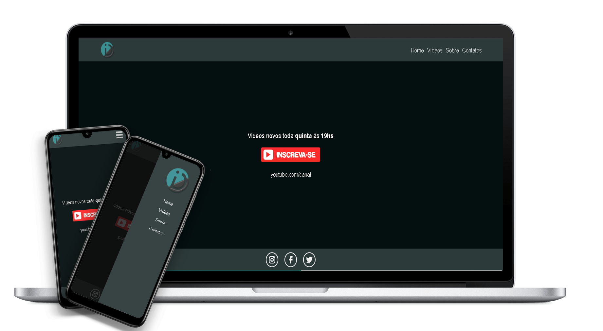

<h1 align="center"> Primeiro projeto Vue.js</h1>

<p align="center">
    
</p>



## Tecnologias Utilizadas no projeto :construction:

- [Node.js](https://nodejs.org/en/) 
- [Vue.js](https://vuejs.org/) 
- [Axios](https://github.com/axios/axios) 


## Projeto :computer:

Este projeto tem como objetivo aprender a cria SPA com Vue.js tem por base 
um projeto que encontrei em um canal do youtube WDEV em que estou aprendendo 
este novo framework JavaScript
  

> - vue create 
>
> ```vue create primeiro_projeto_vue ```

## Como executar :gear:

- Clone o repositório `https://github.com/DioenDJS/Primeiro_projeto_Vue`.
- Install as dependências com o comando `npm install`.
- Rode o `npm run serve` para iniciar a aplicação.<br />
Ao final a aplicação estará disponível em `http://localhost:8080`.

## Dependências do Projetos :card_index_dividers:


> - axios
>
> ``npm install axios``

## Aprendizado:
> - O que aprendi neste projeto com o primeiro contato que tive no Vue.js 
